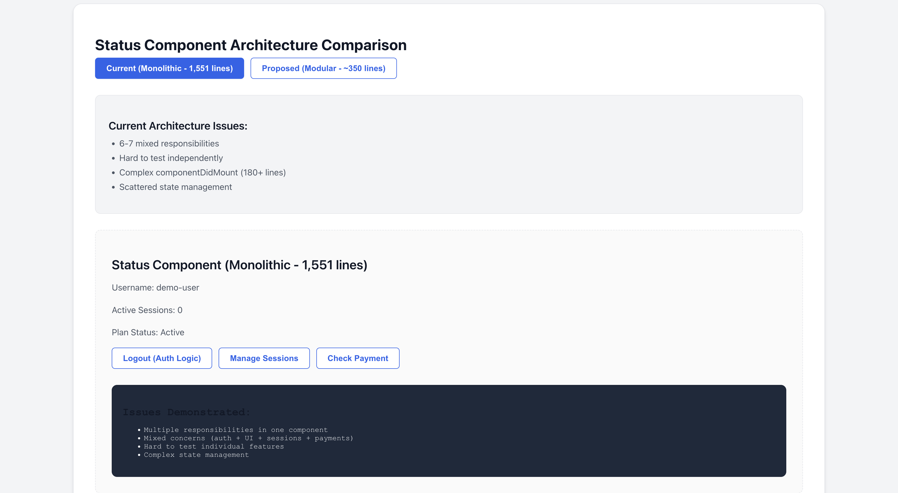
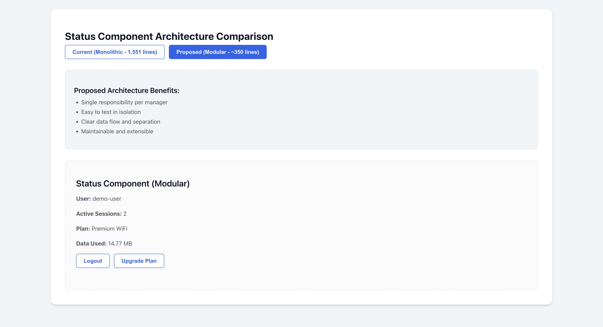
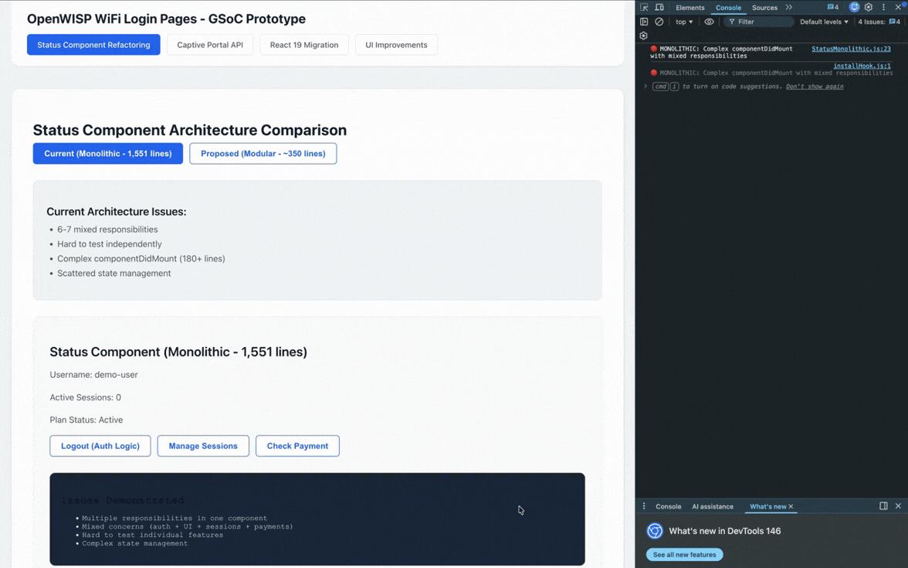
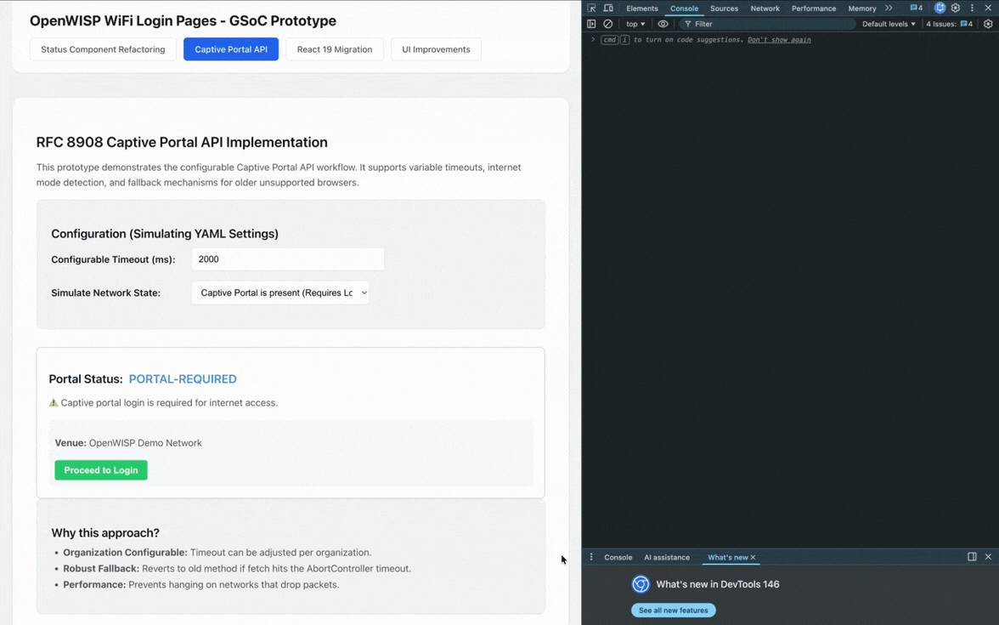
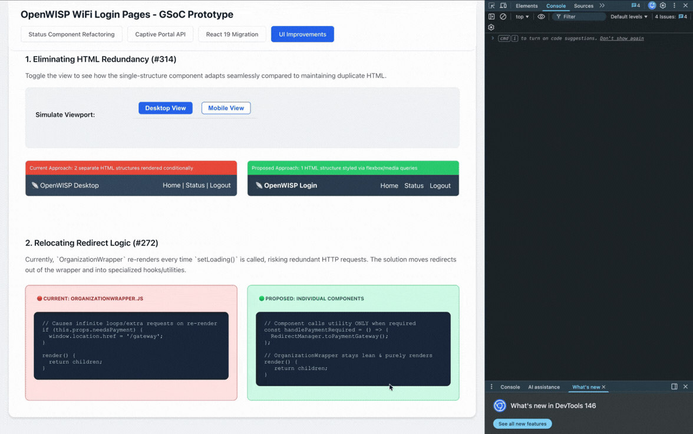
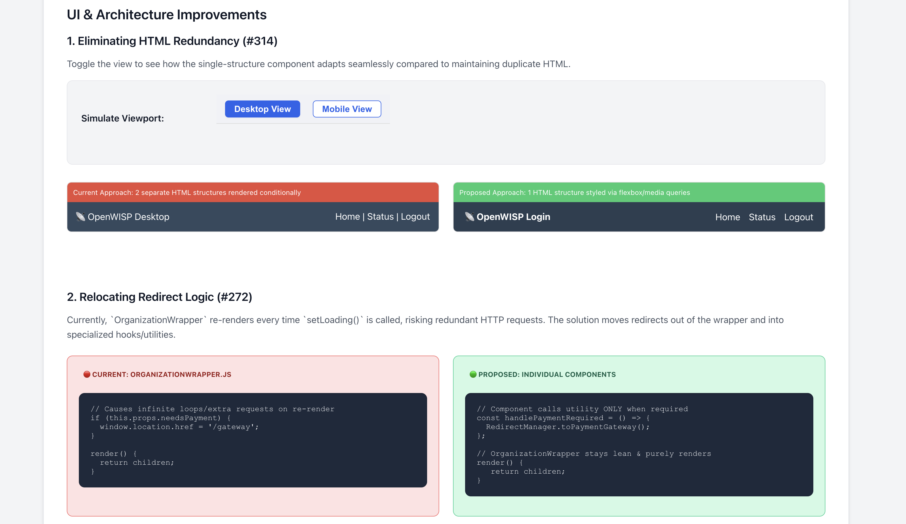

# OpenWISP WiFi Login Pages - GSoC 2026 Prototype

> **A technical proof-of-concept and architectural demonstration for the OpenWISP WiFi Login Pages Modernization Proposal (Google Summer of Code 2026).**

This repository serves as a tangibile, interactive dashboard designed to demonstrate the architectural refactoring, UI improvements, and API integrations proposed for the OpenWISP networking suite. Rather than testing directly against the legacy codebase, this isolated environment proves out modern React patterns, strict separation of concerns, and stable testing practices before integrating them into the official upstream repository.

---

## What is Demonstrated (Interactive Demos)

This prototype acts as an interactive pitch deck and features four primary technical pillars outlining my proposed solutions.

### 1. Status Component Refactoring (Monolithic vs. Modular)
The current OpenWISP `Status.js` component has grown into a "God Object" spanning over 1,500 lines, mixing UI rendering, state management, and external API requests. 

This demo proposes stripping business logic out of the presentation layer by injecting distinct, isolated instance managers (`AuthenticationManager`, `PaymentManager`, `SessionManager`).

<table>
  <tr>
    <td align="center"><strong>Before: Monolithic Complexity</strong></td>
    <td align="center"><strong>After: Modular Simplicity</strong></td>
  </tr>
  <tr>
    <td></td>
    <td></td>
  </tr>
</table>

**Live Demo:**



### 2. Captive Portal API Implementation (RFC 8908)
Detecting network state robustly without UI hangs is traditionally difficult. This demo showcases a specialized module that implements the new Captive-Portal API while dynamically providing automated fallbacks for unsupported browsers.

**Live Demo:**



### 3. UI Redundancy & Redirect Logic Fixes
The existing architecture maintains duplicate DOM trees for mobile and desktop viewports, and handles HTTP external redirects inside the main wrapper's `.render()` method—risking infinite loops. This prototype introduces a single CSS-driven responsive view algorithm and handles redirects strictly at the interaction level.

**Live Demo:**




### 4. Automated Testing Migration (Enzyme ➔ RTL)
Enzyme is officially deprecated. Upgrading to React 19 inherently forces a testing overhaul. Because the proposed architecture decouples logic into pure Utility Functions and isolated Managers, comprehensive testing becomes significantly easier.

*This repository includes 100% passing tests for the newly created Utility and Manager logic, simulating how RTL combined with Jest will be utilized.*


---

## How to Run Locally

You can spin up this interactive proposal locally on any machine with Node installed.

```bash
# Clone the repository
git clone https://github.com/o1-spec/wifi-login-pages-prototype.git
cd wifi-login-pages-prototype

# Install dependencies
npm install

# Start the interactive UI server
npm start

# Run the automated Jest & RTL test suite
npm test
```

---

## Key Technical Choices & Architecture

- **React 19 Readiness:** The app leverages modern hooks and clears away legacy Class Component lifecycles to enable asynchronous UI transitions without blocking the main JS thread.
- **Custom Class Managers over Redux:** Using vanilla JavaScript class instances (e.g. `PaymentManager.js`) to wrangle state allows components to subscribe cleanly without heavy library overhead.
- **Fetch API + AbortController:** Utilizing native HTTP APIs paired with `AbortController` handles network timeouts cleanly when making Captive Portal configuration requests.
- **React Testing Library (RTL):** Transitioning away from state-sniffing to behavior-driven testing to guarantee components perform accurately according to actual human interaction.